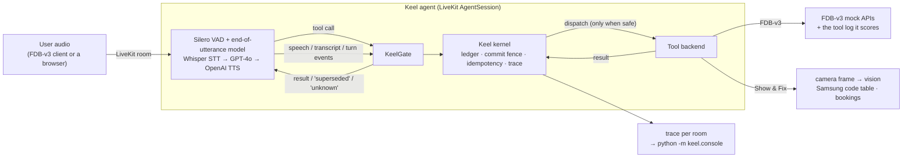

# Keel

**An interruption-safe execution layer for voice agents.** Keel sits between a
LiveKit voice agent's LLM and its tools, and decides *whether and when* a tool
call may run:

- **Held until the user has finished.** A call waits until the user's turn has
  ended, they are not speaking, and a short quiet period has passed.
- **Dropped if the user keeps talking.** "Flights to Paris… no, Berlin": if the
  LLM planned the Paris call before the correction arrived, the call is still
  held, so it is dropped. It never runs, and the benchmark never sees it.
- **Run at most once per session.** An identical call (same tool, same arguments
  after defaults and types are normalised) returns the first result.
- **Truthful.** A write whose outcome cannot be confirmed is reported as unknown,
  never as done.

Built for the Samsung PRISM GenAI Hackathon, Theme 05 (Interruptible Real-Time
Agents), and evaluated on **Full-Duplex-Bench v3** (FDB-v3), as the updated
participant guide requires.

## Why this layer

The FDB-v3 paper (arXiv:2604.04847) finds self-correction to be the hardest
category for every published system. The cascaded Whisper → GPT-4o pipeline
passes only 0.176 of those scenarios because "Whisper finalizes the initial
transcription before the correction arrives". Gemini Live 3.1's tool call was
"invoked before the user finished correcting, locking in destination='Rome'".
FDB-v3's strict pass rate fails a scenario on *any* unexpected call. A call that
executed on a retracted value cannot be taken back, so Keel holds every call
until the user has finished (end of turn plus 600 ms of quiet) and drops the
ones that new speech overtakes before they are sent. When a turn is nothing but
an editing term ("Oh, wait."), the repair is still to come (Levelt 1983), so a
call planned from it waits for the next turn, for at most the template's own 5 s
end-of-turn limit. In our Gemini Live smoke run, a call planned from "Oh, wait."
went out 1.6 s before the user said the new date; this rule holds it
(`keel/kernel/repair.py`, fence rule 4). In a cascade, a turn can also be
committed from the first stretches of speech while the last one, already spoken,
is still being transcribed; in our open-pipeline travel_10 run the Oct 5 search went
out 5 s before the words "make it October 7th" arrived. So a call also waits for
the words of every stretch of speech that has ended (fence rule 5, capped at 8 s
for a stretch that yields no words). A correction that arrives after a call
has gone out cannot be undone, by Keel or anyone. See `SOURCES.md` for every
quote and number.

## Architecture



| Part | File | What it does |
|---|---|---|
| Kernel | `keel/kernel/` | Single-writer event loop: call ledger (status machine, idempotency keys), commit fence, slot versions, reconciliation of in-doubt writes. Unchanged in spirit since phase 2; details in `docs/ARCHITECTURE.md`. |
| Manifest compiler | `keel/compiler/` | Read-only vs state-changing per tool (hints, then a measured classifier, then "unknown" = write), argument validation, spoken acknowledgments, status probes. |
| LiveKit layer | `keel/livekit/` | `gate.py` turns LLM tool calls and session events into kernel events. `session.py` builds the pipeline and the guarded tools. `template.py` reads FDB-v3's tools and instructions from its own agent file. `fdb.py` runs FDB-v3's mock APIs and writes the log its runner scores. |
| Benchmark agent | `keel/livekit/agent.py` | FDB-v3's cascaded template pipeline, with Keel under every tool call. |
| **Extension** | `extension/show_and_fix/` | **Show & Fix**, see below. |
| Model providers | `keel/providers.py` | Named OpenAI-compatible endpoints (`[providers]` in `config/keel.toml`: OpenAI, Gemini, Groq, a local Ollama, the local speech server). Any stage of the `open` pipeline, and Show & Fix's display reader, can use any of them. |
| Local speech server | `keel/speech/` | faster-whisper (speech-to-text) and Kokoro (text-to-speech) behind the two OpenAI endpoints LiveKit's plugin calls, for the `open` pipeline. `scripts/open_models.sh` installs and starts it, and Ollama. |
| Web app | `keel/web/` | The product's face (below): talk to the agent live, replay any session with its recorded audio, read benchmark results, check the setup. |
| Trace console | `keel/console/` | A developer's page per set of traces: invariants, latency, timeline, every record. |

Configuration is `config/keel.toml` plus a profile: `config/fdb_v3.toml` for the
benchmark, `config/show_and_fix.toml` for the extension. Every value gives its
source. `KEEL_PIPELINE` picks the pipeline for either agent.

### Pipelines, and what each costs

| Pipeline | Models | Keys | Cost |
|---|---|---|---|
| `cascaded` (default, the organisers' re-run) | OpenAI whisper-1, gpt-4o, tts-1 | `OPENAI_API_KEY` | paid |
| `gpt_realtime` | OpenAI gpt-realtime-1.5 | `OPENAI_API_KEY` | paid |
| `gemini_realtime` | Gemini Live `gemini-3.1-flash-live-preview` (FDB-v3's own `gemini3_1` provider); Show & Fix reads the display with `gemini-2.5-flash` | `GOOGLE_API_KEY` | free tier |
| `open` | open-weight models on this machine: faster-whisper small.en, Qwen3-4B-Instruct-2507 (Ollama), Kokoro-82M; Show & Fix reads with Qwen3-VL-2B | none | free, no limits |

All four keep Keel under every tool call, need LiveKit Cloud's free keys, and use
LiveKit's local VAD and end-of-utterance model where they apply. Any stage of `open`
can be moved to a hosted provider by changing two lines in `[livekit.open]`, e.g.
`llm_provider = "groq"`, `llm_model = "openai/gpt-oss-20b"` (Groq's free tier).
Sources and measurements for every model: `SOURCES.md`, "Free and open-weight models".

## Run the benchmark (one command)

Declared provider: **OpenAI** (whisper-1, gpt-4o, tts-1) through **LiveKit Cloud**,
plus LiveKit's local end-of-utterance model. `--pipeline gpt_realtime` switches
to OpenAI gpt-realtime-1.5, also with Keel under every tool call.

`--pipeline gemini_realtime` runs Gemini Live (`gemini-3.1-flash-live-preview`, the model
of FDB-v3's own `gemini3_1` provider in `lk_agent_tool.py`), again with Keel under every
tool call. It needs only a Gemini API key, and Google's pricing page lists the model as
free of charge on the free tier (`SOURCES.md`). Without an `OPENAI_API_KEY`, the run
scores with FDB-v3's rule-based evaluation (its scripts without `--use-llm`: tool
selection and exact-match arguments, no response-quality score), and `run_info.txt`
records `judge: none`. Those numbers are not comparable with gpt-4o-judged ones.

1. Copy `.env.example` to `.env` and fill in `LIVEKIT_URL`, `LIVEKIT_API_KEY`,
   `LIVEKIT_API_SECRET` (a free LiveKit Cloud project) and `OPENAI_API_KEY`
   (or `GOOGLE_API_KEY` for `--pipeline gemini_realtime`; no model key for
   `--pipeline open`). The keys are never committed.
   Before the long steps, the script makes one minimal request to each model provider
   the run needs, so a key without credit or model access stops the run at once.
2. On Linux or macOS (on Windows, inside WSL) with `git`, `ffmpeg` and Python 3.10.
   The first run downloads several GB (PyTorch and CUDA libraries for FDB-v3's ASR):

```
scripts/reproduce_fdb_v3.sh                        # full run: 100 recordings + 3 evaluations
scripts/reproduce_fdb_v3.sh --example travel_10    # smoke test: one recorded self-correction scenario
PYTHON=/path/to/python3.10 scripts/reproduce_fdb_v3.sh --pipeline gpt_realtime
scripts/reproduce_fdb_v3.sh --pipeline gemini_realtime    # Gemini API key only
scripts/reproduce_fdb_v3.sh --pipeline open               # open-weight models, no model key
```

`--pipeline open` first runs `scripts/open_models.sh start`: it downloads Ollama 0.34.4,
the LLM and the speech models (pinned by version, revision or sha256; about 5 GB the
first time), starts Ollama and `python -m keel.speech` on 127.0.0.1, and waits until both
answer; the run stops them at the end and records the models and the LLM's digest in
`run_info.txt`. Speech runs on the CPU (about 3 s per turn for Whisper) and the LLM on the
GPU. On a 4 GB laptop GPU that also drives the desktop, set `KEEL_OLLAMA_CONTEXT=4096` so
the whole model fits, and run plugged in: on battery our laptop's GPU was throttled to
7 generated tokens/s, too slow to answer inside FDB-v3's recordings (`SOURCES.md`). The
evaluation machine's GPU has neither limit.

The script creates two locked environments (`requirements/agent.lock.txt` and
`requirements/bench.lock.txt`, resolved for Linux x86-64 / Python 3.10). It then
clones FDB-v3 at a pinned commit, downloads its audio, and downloads the agent's
model weights. It starts Keel's agent, runs FDB-v3's **unmodified** inference
script, and runs its three evaluations (with the gpt-4o judge when an OpenAI key is set). Everything lands in
`results/fdb_v3/<timestamp>_<provider>/`: the reports, per-scenario results,
the scored tool-log lines, Keel's traces and console page, the agent and runner
logs, both `pip freeze` outputs, commits, seeds and the configuration.

From a Windows checkout, run the same script inside WSL (Ubuntu, with `rsync`) from PowerShell:

```
wsl bash scripts/reproduce_fdb_v3_wsl.sh --example travel_10
wsl bash scripts/reproduce_fdb_v3_wsl.sh
```

It copies the checkout (with `.env`) to `~/keel` in WSL, runs there on the Linux file system,
and copies the run's folder back to `results/fdb_v3/`. The environments stay in WSL between runs.

**Run only one agent per LiveKit project.** Keel's agents (like FDB-v3's templates) use
LiveKit's automatic dispatch, so any other agent running against the same project, a
Show & Fix dev session included, would join the benchmark's rooms too.

Model availability: `whisper-1` shuts down on Feb 26, 2027 and the `gpt-realtime` family on
Jan 20, 2027 (OpenAI deprecations page, see `SOURCES.md`). `gpt-4o` and `tts-1` are not
scheduled. A later re-run only needs the model name in `config/fdb_v3.toml` changed.

Seeds: the mock latency jitter is seeded per session (`livekit.fdb.seed`), and
the LLM runs at temperature 0 with a fixed seed (`livekit.cascaded.llm_seed`).

**Results:** no full scored run yet. `results/fdb_v3/` holds smoke runs of the
travel_10 self-correction scenario (Gemini Live, cascaded and open, scored without the
gpt-4o judge, so arguments must match exactly), each with its reports, traces and
logs; the open-pipeline runs carry a `NOTE.md` saying exactly what ran. In the latest
ones only the corrected call reaches FDB-v3's tool log. A full Gemini run reached scenario 70 of 100 before the machine stopped it; its
sessions replay in the web app, but it has no reports and claims no score.

## Web app

`python -m keel.web` serves a local app at http://localhost:8765 (bound to 127.0.0.1 only;
`--port` for another). It needs only `pip install -e ".[web]"`, so it also runs on Windows.

- **Overview**: what Keel does, counted across every recorded session (calls planned,
  executed, dropped before they ran, median hold before a call runs), the latest
  benchmark run, and the three rules with the timings from the config.
- **Live demo**: talk to the agent from the browser. One console shows the voice
  visualiser (your microphone and the agent's audio), the transcript as it is spoken,
  each tool call as a card (Planned, Held, Running, Executed, Dropped, Reused, with the
  reason), Keel's decision log with filters, and a turn timeline of who spoke when and
  what each call went through.
- **Sessions → replay**: the same console, played back from any recorded session. A
  benchmark session plays FDB-v3's own recordings (the input audio and the agent's
  recorded reply), lined up with Keel's trace by the first executed call, which both
  record (within 10 ms); the timeline draws both waveforms. Play, pause, ±5 s, 1×/1.5×/2×,
  click the timeline or a decision to jump there; `#/replay/<session>?t=25` opens at 25 s.
  It also shows FDB-v3's verdict for the scenario: expected and made calls, argument by argument.
- **Benchmark**: each run's scores from FDB-v3's reports, by kind of speech, by domain
  and per scenario, each linked to its replay.
- **Setup**: which keys are set (never their values), the model providers, each profile's
  pipelines and models, Keel's fence settings, every tool with the label Keel's compiler
  gives it, and **Test** buttons that make one real request (LiveKit, Gemini, OpenAI, the
  open pipeline's servers, Show & Fix's display reader).

From a Windows checkout, one command starts an agent and the app in WSL:

```
wsl bash scripts/keel_live_wsl.sh --pipeline gemini_realtime                  # benchmark agent, free tier
wsl bash scripts/keel_live_wsl.sh --show-and-fix --pipeline gemini_realtime   # Show & Fix (camera), free tier
wsl bash scripts/keel_live_wsl.sh --pipeline open                             # open-weight models, no key
wsl bash scripts/keel_live_wsl.sh --no-agent                                  # sessions, replays, results only
```

The browser joins a new LiveKit room with a token the server signs from `.env`; the
agent is dispatched to it automatically and sends its action updates to the room on a
text-stream topic (`keel.story`), only to participants who joined from the app, so the
benchmark's own client never receives them. Everything the app shows comes from a trace
record or a report file (`keel/web/story.py`, `keel/web/results.py`, `keel/web/system.py`);
a value that is not there is shown as missing, never estimated. The page is plain HTML,
CSS and JavaScript (`keel/web/static/`, no build step, light and dark themes, usable on a
phone), and loads livekit-client 2.22.3 from jsDelivr only when a live conversation starts.

## Extension use case: Show & Fix  ⟵ *the extension*

A Samsung washer troubleshooting agent that looks through the camera
(guide §3, step 4). The user points their phone or laptop camera at the washer
and says "my washer shows an error, what is it?". The agent:

1. **Reads the display.** A vision model reads the latest camera frame: GPT-4o on
   the OpenAI pipelines, `gemini-2.5-flash` under `gemini_realtime` (free tier),
   Qwen3-VL-2B on the local Ollama under `open`. Below the confidence threshold it
   says the display is unclear and asks, rather than guessing.
2. **Looks the code up.** Only in Samsung's published information-code table
   (`washer_codes.json`, verbatim from samsung.com/sg, source linked).
3. **Walks through the steps**, and offers a technician.
4. **Books the technician.** "Friday… no, Saturday morning" books Saturday
   once: a Friday booking the LLM planned too early is still held by Keel's fence
   (end of turn plus 600 ms) when the correction arrives, so it is dropped before
   it is sent, and an identical booking later in the session is not made twice.
   "Did it go through?" is answered from `list_technician_bookings`, the status
   probe Keel derives from the manifest.

```
python -m pip install -e ".[livekit]"
python -m extension.show_and_fix.agent download-files
KEEL_PIPELINE=gemini_realtime python -m extension.show_and_fix.agent dev   # a Gemini API key only
```

Open the web app's Live demo (or the Agent Console in your LiveKit Cloud project),
connect with the microphone and camera on, and point the camera at the display.
`KEEL_PIPELINE` may also be `cascaded` (OpenAI, the profile's default) or `open`
(after `KEEL_CONFIG=config/show_and_fix.toml scripts/open_models.sh start`).
Without a camera, `KEEL_SHOW_AND_FIX_IMAGE=photo.jpg` makes the agent use a still
photo, and the trace records it as a file.

## Tests

```
python -m pip install -e ".[dev]"
python -m pytest                              # kernel, compiler, gate, extension, console, providers
python -m pip install -e ".[dev,web,speech]"  # plus: the web app's API and the speech server
python -m pip install -e ".[dev,livekit]"     # plus: a real LiveKit AgentSession, offline
KEEL_FDB_DIR=<FDB-v3 checkout>/v3 python -m pytest tests/test_livekit_template.py
python -m eval.grid_self_repair               # 3,072 timing/fault combinations
python -m eval.showcase                       # 5 synthetic sessions -> traces/console.html
```

CI runs the core suite, the label build, the grid and the showcase on Python
3.10–3.12. A separate LiveKit job (Python 3.10, from `requirements/agent.lock.txt`)
clones FDB-v3 at the pinned commit and runs the LiveKit, template and extension
tests against its real tool definitions and mock APIs.

## Honesty notes

- No full benchmark score has been measured yet; only single-scenario smoke runs
  exist (see Results above). Nothing here claims a score.
- The web app shows only what traces and FDB-v3's reports contain. A session without
  a recording replays without sound and says so; the bars then show voice activity
  from the trace, not audio.
- Nothing is tuned on FDB-v3 items. Keel's rules are general, its timing values
  come from published conversation research (`SOURCES.md`), and its extra
  instructions are four general sentences (`config/fdb_v3.toml`). The benchmark
  data is used only to check formats: every expected argument shape must pass
  Keel's validation.
- Showcase sessions (`eval/showcase.py`) are synthetic and labelled so.

More: `docs/ARCHITECTURE.md` · `docs/JUDGE_QA.md` · `docs/DEMO_SCRIPT.md` (the video, shot by shot) · `docs/reports/` · `SOURCES.md`
