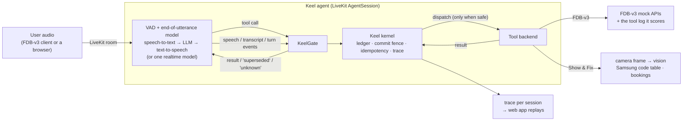

# Keel

**An interruption-safe execution layer for real-time voice agents.**

Keel sits between a voice agent's language model and its tools, and decides *whether
and when* each tool call may run. The model can plan as early as it likes; Keel makes
sure an action only happens once the user has actually finished saying what they want.

Samsung PRISM GenAI Hackathon 2026, **Theme 05: Interruptible Real-Time Agents**.
Built on **LiveKit Agents** and evaluated on **Full-Duplex-Bench v3** (FDB-v3).

| | |
|---|---|
| Presentation | [`Keel_Theme05_PRISM.pptx`](Keel_Theme05_PRISM.pptx) · [PDF](Keel_Theme05_PRISM.pdf) |
| Demo video | [Watch on Google Drive](https://drive.google.com/file/d/1iw0AbQnh6XjdW6kOBBN92SjrbucEm6BR/view?usp=sharing) (5:28) · also in the repo as [`Keel_Demo.mp4`](Keel_Demo.mp4) |
| AI disclosure | [`AI_DISCLOSURE.md`](AI_DISCLOSURE.md) |
| Dependencies | [`requirements.txt`](requirements.txt), locked environments in [`requirements/`](requirements/) |
| Extension use case | [Show & Fix](#extension-use-case-show--fix), a Samsung washer assistant that can see |

---

## The problem

People don't speak in clean commands. A real caller from FDB-v3:

> "Looking at flights to Miami on October 5th. Oh, wait. My schedule just changed…
> so actually make it October 7th instead."

Most voice assistants act on the first thing they hear. They search, book or pay for
the 5th before the caller has finished, and an action that has already gone out cannot
be taken back. The FDB-v3 paper (arXiv:2604.04847) finds self-correction to be the
hardest category for every published system: the cascaded Whisper → GPT-4o pipeline
passes 18% of those scenarios and the best system 59%. The paper names both causes:
speech-to-text "finalizes the initial transcription before the correction arrives", and
realtime models invoke tools "before the user finished correcting".

## How Keel works

Keel applies four rules to every tool call, whatever the model or pipeline:

| Rule | Behaviour |
|---|---|
| **Held** until the user has finished | A call waits until the user's turn has ended and 600 ms of quiet have passed, and until everything already said has been transcribed. After a turn that is only an editing term ("oh, wait"), it waits for the correction that follows. |
| **Dropped** when the user takes it back | If the user keeps speaking or corrects themselves before a held call goes out, the call is dropped and the model is told why. A dropped call never reaches the tool. |
| **Run once** | An identical call later in the session (same tool, same normalised arguments) returns the first result, so nothing is booked twice. |
| **Truthful** | A write whose outcome cannot be confirmed is reported as unknown and checked with a read-only probe, never reported as done. |

The timings are taken from published conversation research (Roberts & Francis 2013;
Jefferson 1988; Levelt 1983), not tuned on the benchmark. Every value and quote is
sourced in [`SOURCES.md`](SOURCES.md).

What makes the approach different:

- **The model is never slowed down.** Keel gates only the *execution* of an action, not
  the model's thinking, and it cancels only what the user actually changed. An
  interruption alone does not throw away useful work.
- **Model-agnostic.** The same layer runs under a cascaded pipeline, OpenAI Realtime,
  Gemini Live, or open-weight models running locally with no API key.
- **Tool semantics are compiled, not hand-written.** Keel's manifest compiler labels each
  tool as read-only or state-changing from its definition, validates arguments, and
  derives a status probe for writes.
- **Verified.** 3,072 simulated timing-and-failure combinations produce zero rule
  violations, zero double bookings and zero false "done" claims
  (`python -m eval.grid_self_repair`).

## Architecture



| Component | Location | Responsibility |
|---|---|---|
| Kernel | `keel/kernel/` | Single-writer event loop: call ledger (status machine, idempotency keys), commit fence, slot versions, reconciliation of in-doubt writes. |
| Manifest compiler | `keel/compiler/` | Read-only vs state-changing label per tool (tool hints, then a measured classifier, otherwise treated as a write), argument validation, spoken acknowledgements, status probes. |
| LiveKit layer | `keel/livekit/` | `gate.py` turns LLM tool calls and session events into kernel events; `session.py` builds the pipeline and guarded tools; `template.py` reads FDB-v3's tools and instructions from its own agent file; `fdb.py` runs FDB-v3's mock APIs. |
| Benchmark agent | `keel/livekit/agent.py` | FDB-v3's agent template with Keel under every tool call. |
| **Extension** | `extension/show_and_fix/` | **Show & Fix** (below). |
| Model providers | `keel/providers.py` | Named OpenAI-compatible endpoints (`config/keel.toml`): OpenAI, Gemini, Groq, local Ollama, local speech server. |
| Local speech server | `keel/speech/` | faster-whisper and Kokoro behind OpenAI-compatible endpoints, for the fully local pipeline. |
| Web app | `keel/web/` | Live conversations, session replays with recorded audio, benchmark results, setup checks. |
| Trace console | `keel/console/` | Per-trace developer view: invariants, latency, timeline, every record. |

Configuration is `config/keel.toml` plus a profile: `config/fdb_v3.toml` for the
benchmark and `config/show_and_fix.toml` for the extension. Every value cites its source.
A detailed walkthrough is in [`docs/ARCHITECTURE.md`](docs/ARCHITECTURE.md).

### Pipelines

| Pipeline (`KEEL_PIPELINE`) | Models | Keys |
|---|---|---|
| `cascaded` (default) | OpenAI whisper-1, gpt-4o, tts-1 | `OPENAI_API_KEY` |
| `gpt_realtime` | OpenAI gpt-realtime-1.5 | `OPENAI_API_KEY` |
| `gemini_realtime` | Gemini Live `gemini-3.1-flash-live-preview` (FDB-v3's own `gemini3_1` provider) | `GOOGLE_API_KEY` (free tier) |
| `open` | faster-whisper small.en, Qwen3-4B-Instruct-2507 (Ollama), Kokoro-82M, all local | none |

Every pipeline runs with Keel under every tool call and needs a (free) LiveKit Cloud
project. Any stage of `open` can be moved to a hosted provider by changing two lines in
`[livekit.open]`.

## Repository layout

```
keel/            kernel, compiler, LiveKit layer, web app, speech server, trace console
extension/       Show & Fix, the extension use case
config/          keel.toml and the benchmark / extension profiles
scripts/         one-command benchmark reproduction, local model setup, live demo launcher
eval/            simulation grid, showcase sessions, result analysis
tests/           unit and integration tests
results/fdb_v3/  benchmark runs: reports, per-scenario results, traces, logs, configuration
docs/            architecture, judge Q&A, demo script, reports
```

## Quick start

Requirements: Python 3.10–3.12, a free [LiveKit Cloud](https://cloud.livekit.io) project,
and a model key for the chosen pipeline (none for `open`).

```
git clone https://github.com/PROSTLE/samsung.git keel && cd keel
python -m pip install -r requirements.txt
cp .env.example .env        # LIVEKIT_URL, LIVEKIT_API_KEY, LIVEKIT_API_SECRET, and OPENAI_API_KEY or GOOGLE_API_KEY
python -m keel.livekit.agent download-files
```

Start the agent and the web app (two terminals):

```
KEEL_PIPELINE=gemini_realtime python -m keel.livekit.agent dev
python -m keel.web          # http://localhost:8765
```

Open **Live demo → Start conversation** and try: *"Find me flights to Miami on October
5th… oh, wait, make it the 7th."* One search runs, for the 7th.

On Windows, one command starts both inside WSL:

```
wsl bash scripts/keel_live_wsl.sh --pipeline gemini_realtime                  # benchmark agent
wsl bash scripts/keel_live_wsl.sh --show-and-fix --pipeline gemini_realtime   # Show & Fix (camera)
wsl bash scripts/keel_live_wsl.sh --pipeline open                             # local models, no key
wsl bash scripts/keel_live_wsl.sh --no-agent                                  # sessions and results only
```

Run only one agent per LiveKit project: agents use automatic dispatch, so every running
agent joins every room.

## Run the benchmark (one command)

Declared provider: **OpenAI** (whisper-1, gpt-4o, tts-1) through **LiveKit Cloud**, plus
LiveKit's local end-of-utterance model. On Linux or macOS (on Windows, inside WSL) with
`git`, `ffmpeg` and Python 3.10:

```
scripts/reproduce_fdb_v3.sh                                # full run: 100 recordings + 3 evaluations
scripts/reproduce_fdb_v3.sh --example travel_10            # smoke test: one self-correction scenario
scripts/reproduce_fdb_v3.sh --pipeline gpt_realtime        # OpenAI Realtime
scripts/reproduce_fdb_v3.sh --pipeline gemini_realtime     # Gemini API key only
scripts/reproduce_fdb_v3.sh --pipeline open                # local open-weight models, no key
wsl bash scripts/reproduce_fdb_v3_wsl.sh                   # the same, from a Windows checkout
```

The script:

1. checks each model provider the run needs with one minimal request, so a missing key
   or quota stops the run immediately;
2. creates two locked environments (`requirements/agent.lock.txt`,
   `requirements/bench.lock.txt`, Linux x86-64 / Python 3.10);
3. clones FDB-v3 at a pinned commit, downloads its audio and the agent's model weights;
4. starts Keel's agent, runs FDB-v3's **unmodified** inference script, and runs its three
   evaluations (with the gpt-4o judge when an OpenAI key is set, otherwise FDB-v3's
   rule-based scoring, recorded as `judge: none`);
5. writes everything to `results/fdb_v3/<timestamp>_<provider>/`: reports, per-scenario
   results, the scored tool log, Keel's traces, agent and runner logs, both `pip freeze`
   outputs, commits, seeds and the configuration.

`--pipeline open` first runs `scripts/open_models.sh start`, which installs pinned
versions of Ollama, the LLM and the speech models (about 5 GB the first time), serves
them on 127.0.0.1, and records the model digests in `run_info.txt`.

Reproducibility: the mock-API latency jitter is seeded per session (`livekit.fdb.seed`),
the LLM runs at temperature 0 with a fixed seed (`livekit.cascaded.llm_seed`), and every
dependency and model is pinned.

## Results

Full run of all 100 FDB-v3 recordings on Gemini Live 3.1, the same model the paper
evaluates (`results/fdb_v3/20260928T211335Z_keel_gemini_realtime/`), scored with
FDB-v3's own scripts using its rule-based evaluation, so arguments must match exactly:

| Metric | Keel on Gemini Live 3.1 | Gemini Live 3.1 in the paper |
|---|---|---|
| Turns answered (turn-taking) | **100%** | 78.0% |
| Talks over the user (interruption rate) | **5%** | 19.2% |
| Strict pass rate | 48/100 | *judged, not comparable* |
| Tool selection | 89.4% | |
| Self-correction pass rate | 52.9% | |
| First response, median / mean | 4.16 s / 5.12 s | 3.95 s (first word) |

Turn-taking and interruption come from the benchmark's judge-free latency script, so
they compare directly with the paper. The paper's pass rates use an LLM judge that
compares arguments by meaning; ours are exact-match. Most of our remaining failures
differ from the expected value only in form (for example a date written as the tool's
own schema documents it); `python -m eval.form_equivalence` re-counts those under a
stated rule and gives 66/100, an estimate rather than a score. The organisers' re-run
uses the judge.

By kind of speech: self-correction 0.529, false start 0.583, hesitation 0.400,
pause 0.389, filler 0.345. The first full run scored 43/100 with 84% of turns answered
and 24% on self-corrections; the analysis of each run is in
[`docs/reports/RERUN_2026-09-28.md`](docs/reports/RERUN_2026-09-28.md).

## Extension use case: Show & Fix

**A Samsung washer troubleshooting assistant that can see.** The user points their phone
or laptop camera at the washer and asks what the error means. The agent:

1. **Reads the display** with a vision model (gpt-4o, `gemini-2.5-flash` or Qwen3-VL-2B,
   following the pipeline). Below its confidence threshold it says the display is unclear
   and asks, rather than guessing.
2. **Looks the code up** only in Samsung's published information-code table
   (`extension/show_and_fix/washer_codes.json`, from samsung.com/sg, source linked).
3. **Walks through the fix**, and offers a technician.
4. **Books the technician safely.** "Friday… no, Saturday morning" books Saturday once:
   the Friday booking the model planned too early is still held by Keel when the
   correction arrives, so it is dropped before it is sent. "Did it go through?" is
   answered from `list_technician_bookings`, the status probe Keel derives for the
   booking tool, instead of from memory.

```
python -m extension.show_and_fix.agent download-files
KEEL_PIPELINE=gemini_realtime python -m extension.show_and_fix.agent dev
```

Open the web app's **Live demo**, allow the microphone and camera, and point the camera at
the display. Without a camera, `KEEL_SHOW_AND_FIX_IMAGE=photo.jpg` uses a still photo.
The booking service is Keel's own, since Samsung offers no public booking API.

## Web app

`python -m keel.web` serves a local app (127.0.0.1 only; `--port` to change it). It needs
only the `web` extra, so it also runs natively on Windows.

- **Overview**: Keel's activity across every recorded session (calls planned, executed,
  dropped before they ran, median hold), the latest benchmark run, and the rules with the
  configured timings.
- **Live demo**: talk to the agent in the browser. The conversation shows each tool call
  as a card (Planned, Held, Running, Executed, Dropped, Reused, with the reason), Keel's
  decision log, and a turn timeline of who spoke when.
- **Sessions → replay**: any recorded session played back with its audio. Benchmark
  sessions play FDB-v3's own recordings aligned with Keel's trace; click the timeline or
  a decision to jump there. Each shows FDB-v3's verdict, argument by argument.
- **Benchmark**: each run's scores by kind of speech, by domain and per scenario, each
  linked to its replay.
- **Setup**: which keys are set (never their values), pipelines and models, fence
  settings, every tool with its compiled label, and one-click connection tests.

Everything the app shows is read from a trace record or a report file; a missing value is
shown as missing, never estimated. The front end is plain HTML, CSS and JavaScript with
no build step, in light and dark themes.

## Tests

```
python -m pytest                              # kernel, compiler, gate, extension, console, providers
KEEL_FDB_DIR=<FDB-v3 checkout>/v3 python -m pytest tests/test_livekit_template.py
python -m eval.grid_self_repair               # 3,072 timing and fault combinations
python -m eval.showcase                       # 5 synthetic sessions -> traces/console.html
```

CI runs the core suite, the tool-label build, the simulation grid and the showcase on
Python 3.10–3.12. A separate LiveKit job installs `requirements/agent.lock.txt`, clones
FDB-v3 at the pinned commit, and runs the LiveKit, template and extension tests against
its real tool definitions and mock APIs.

## Evaluation integrity

- Nothing is trained, tuned or prompted on FDB-v3's test items. Keel's rules are general,
  its timings come from published research, and its added instructions are general
  sentences that apply to any tool (`config/fdb_v3.toml`). Benchmark data is used only to
  check that every expected argument shape passes Keel's validation.
- Our published runs use FDB-v3's rule-based scoring; no judged score is claimed. Only the
  organisers' re-run produces one.
- Synthetic material (showcase sessions, the test washer display) is labelled as such.

## Documentation

- [`docs/ARCHITECTURE.md`](docs/ARCHITECTURE.md): design and data flow in detail
- [`docs/JUDGE_QA.md`](docs/JUDGE_QA.md): design questions and answers, with sources
- [`docs/DEMO_SCRIPT.md`](docs/DEMO_SCRIPT.md): the demo video, shot by shot
- [`docs/reports/`](docs/reports/): development and benchmark reports
- [`SOURCES.md`](SOURCES.md): every external number, quote and model version
- [`AI_DISCLOSURE.md`](AI_DISCLOSURE.md): use of AI in building and running Keel
