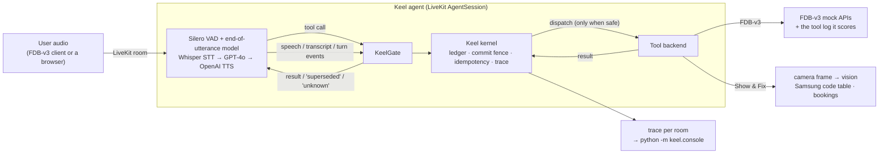

# Keel

**An interruption-safe execution layer for voice agents.** Keel sits between a
LiveKit voice agent's LLM and its tools, and decides *whether and when* a tool
call may run:

- **Held until the user has finished.** A call waits until the user's turn has
  ended, they are not speaking, and a short quiet period has passed.
- **Dropped if the user keeps talking.** "Flights to Paris… no, Berlin": if the
  LLM planned the Paris call before the correction arrived, the call is still
  held, so it is dropped. It never runs, and the benchmark never sees it.
- **Run at most once per session.** An identical call (same tool, same arguments
  after defaults and types are normalised) returns the first result.
- **Truthful.** A write whose outcome cannot be confirmed is reported as unknown,
  never as done.

Built for the Samsung PRISM GenAI Hackathon, Theme 05 (Interruptible Real-Time
Agents), and evaluated on **Full-Duplex-Bench v3** (FDB-v3), as the updated
participant guide requires.

## Why this layer

The FDB-v3 paper (arXiv:2604.04847) finds self-correction to be the hardest
category for every published system. The cascaded Whisper → GPT-4o pipeline
passes only 0.176 of those scenarios because "Whisper finalizes the initial
transcription before the correction arrives". Gemini Live 3.1's tool call was
"invoked before the user finished correcting, locking in destination='Rome'".
FDB-v3's strict pass rate fails a scenario on *any* unexpected call. A call that
executed on a retracted value cannot be taken back, so Keel holds every call
until the user has finished (end of turn plus 600 ms of quiet) and drops the
ones that new speech overtakes before they are sent. A correction that arrives
after a call has gone out cannot be undone, by Keel or anyone. See `SOURCES.md`
for every quote and number.

## Architecture



| Part | File | What it does |
|---|---|---|
| Kernel | `keel/kernel/` | Single-writer event loop: call ledger (status machine, idempotency keys), commit fence, slot versions, reconciliation of in-doubt writes. Unchanged in spirit since phase 2; details in `docs/ARCHITECTURE.md`. |
| Manifest compiler | `keel/compiler/` | Read-only vs state-changing per tool (hints, then a measured classifier, then "unknown" = write), argument validation, spoken acknowledgments, status probes. |
| LiveKit layer | `keel/livekit/` | `gate.py` turns LLM tool calls and session events into kernel events. `session.py` builds the pipeline and the guarded tools. `template.py` reads FDB-v3's tools and instructions from its own agent file. `fdb.py` runs FDB-v3's mock APIs and writes the log its runner scores. |
| Benchmark agent | `keel/livekit/agent.py` | FDB-v3's cascaded template pipeline, with Keel under every tool call. |
| **Extension** | `extension/show_and_fix/` | **Show & Fix**, see below. |
| Trace console | `keel/console/` | One HTML page per set of traces: invariants, latency, timeline, conversation, calls. |

Configuration is `config/keel.toml` plus a profile: `config/fdb_v3.toml` for the
benchmark, `config/show_and_fix.toml` for the extension. Every value gives its
source.

## Run the benchmark (one command)

Declared provider: **OpenAI** (whisper-1, gpt-4o, tts-1) through **LiveKit Cloud**,
plus LiveKit's local end-of-utterance model. `--pipeline gpt_realtime` switches
to OpenAI gpt-realtime-1.5, also with Keel under every tool call.

1. Copy `.env.example` to `.env` and fill in `LIVEKIT_URL`, `LIVEKIT_API_KEY`,
   `LIVEKIT_API_SECRET` (a free LiveKit Cloud project) and `OPENAI_API_KEY`.
   The keys are never committed.
2. On Linux or macOS (on Windows, inside WSL) with `git`, `ffmpeg` and Python 3.10.
   The first run downloads several GB (PyTorch and CUDA libraries for FDB-v3's ASR):

```
scripts/reproduce_fdb_v3.sh                        # full run: 100 recordings + 3 evaluations
scripts/reproduce_fdb_v3.sh --example travel_10    # smoke test: one recorded self-correction scenario
PYTHON=/path/to/python3.10 scripts/reproduce_fdb_v3.sh --pipeline gpt_realtime
```

The script creates two locked environments (`requirements/agent.lock.txt` and
`requirements/bench.lock.txt`, resolved for Linux x86-64 / Python 3.10). It then
clones FDB-v3 at a pinned commit, downloads its audio, and downloads the agent's
model weights. It starts Keel's agent, runs FDB-v3's **unmodified** inference
script, and runs its three evaluations with the gpt-4o judge. Everything lands in
`results/fdb_v3/<timestamp>_<provider>/`: the reports, per-scenario results,
the scored tool-log lines, Keel's traces and console page, the agent and runner
logs, both `pip freeze` outputs, commits, seeds and the configuration.

**Run only one agent per LiveKit project.** Keel's agents (like FDB-v3's templates) use
LiveKit's automatic dispatch, so any other agent running against the same project, a
Show & Fix dev session included, would join the benchmark's rooms too.

Seeds: the mock latency jitter is seeded per session (`livekit.fdb.seed`), and
the LLM runs at temperature 0 with a fixed seed (`livekit.cascaded.llm_seed`).

**Results:** none are reported yet. A run needs the API keys above.
`results/fdb_v3/` will hold our own best run, and the script prints its pass
rate and scores.

## Extension use case: Show & Fix  ⟵ *the extension*

A Samsung washer troubleshooting agent that looks through the camera
(guide §3, step 4). The user points their phone or laptop camera at the washer
and says "my washer shows an error, what is it?". The agent:

1. **Reads the display.** A GPT-4o vision reading of the latest camera frame.
   Below the confidence threshold it says the display is unclear and asks,
   rather than guessing.
2. **Looks the code up.** Only in Samsung's published information-code table
   (`washer_codes.json`, verbatim from samsung.com/sg, source linked).
3. **Walks through the steps**, and offers a technician.
4. **Books the technician.** "Friday… no, Saturday morning" books Saturday
   once: a Friday booking the LLM planned too early is still held by Keel's fence
   (end of turn plus 600 ms) when the correction arrives, so it is dropped before
   it is sent, and an identical booking later in the session is not made twice.
   "Did it go through?" is answered from `list_technician_bookings`, the status
   probe Keel derives from the manifest.

```
python -m pip install -e ".[livekit]"
python -m extension.show_and_fix.agent download-files
python -m extension.show_and_fix.agent dev
```

Open the Agent Console in your LiveKit Cloud project (or the Agents Playground),
connect with the microphone and camera on, and point the camera at the display.
Without a camera, `KEEL_SHOW_AND_FIX_IMAGE=photo.jpg` makes the agent use a still
photo, and the trace records it as a file.

## Tests

```
python -m pip install -e ".[dev]"
python -m pytest                              # kernel, compiler, gate, extension, console
python -m pip install -e ".[dev,livekit]"     # plus: a real LiveKit AgentSession, offline
KEEL_FDB_DIR=<FDB-v3 checkout>/v3 python -m pytest tests/test_livekit_template.py
python -m eval.grid_self_repair               # 3,072 timing/fault combinations
python -m eval.showcase                       # 5 synthetic sessions -> traces/console.html
```

CI runs the core suite, the label build, the grid and the showcase on Python
3.10–3.12. A separate LiveKit job (Python 3.10, from `requirements/agent.lock.txt`)
clones FDB-v3 at the pinned commit and runs the LiveKit, template and extension
tests against its real tool definitions and mock APIs.

## Honesty notes

- The benchmark score has not been measured yet (it needs API keys). Nothing
  here claims one.
- Nothing is tuned on FDB-v3 items. Keel's rules are general, its timing values
  come from published conversation research (`SOURCES.md`), and its extra
  instructions are four general sentences (`config/fdb_v3.toml`). The benchmark
  data is used only to check formats: every expected argument shape must pass
  Keel's validation.
- Showcase sessions (`eval/showcase.py`) are synthetic and labelled so.

More: `docs/ARCHITECTURE.md` · `docs/JUDGE_QA.md` · `docs/DEMO_SCRIPT.md` (the video, shot by shot) · `docs/reports/` · `SOURCES.md`
